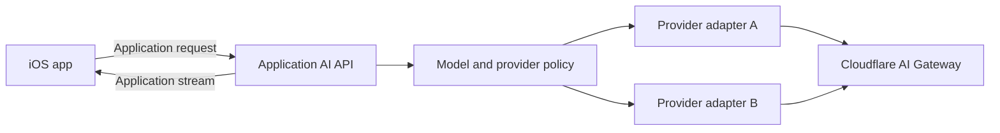

# AI API and Streaming

## Server-owned AI integration

The iOS app calls an application AI API. It does not call an AI provider directly.

The Worker owns provider credentials, model selection, tool access, output limits, timeouts, and context selection. The client requests an application capability, not a provider model.

Cloudflare AI Gateway sits between the Worker and supported AI providers. The Worker remains responsible for authentication, authorization, and request validation.

## Provider adapters

Each AI provider has a server adapter. The adapter maps an application request to the provider request and maps provider events back to application events.

Provider-specific event names never cross the public API boundary. As a result, the iOS app does not change when the server changes providers.



The routing policy can use availability, capability, latency, cost, or a controlled experiment. The server records the selected provider and model for operations.

## Request contract

The application request contains an application request identifier. It also contains the user input and references to authorized server resources.

The request does not contain provider credentials. It does not grant access through client-supplied resource identifiers.

A stable API contract can contain these generic fields:

```json
{
  "requestId": "application-generated-uuid",
  "capability": "text-response",
  "input": {
    "text": "..."
  },
  "conversationId": "optional-application-id",
  "resourceRefs": ["optional-authorized-id"]
}
```

The API versions this contract. A provider API version does not become the application API version.

## Stream protocol

Use HTTPS with Server-Sent Events for one request and one streamed text response. The response uses `Content-Type: text/event-stream`.

Each event contains the application request identifier and a sequence number. The sequence number gives the client a stable event order.

The first protocol can use these events:

| Event | Purpose |
|---|---|
| `started` | Confirms request acceptance and identifies the server request. |
| `delta` | Adds a text fragment or another supported output fragment. |
| `completed` | Marks the authoritative end of the response. |
| `error` | Reports a stream failure after HTTP response headers were sent. |
| `heartbeat` | Keeps a quiet connection active when infrastructure requires it. |

Example:

```text
event: started
data: {"requestId":"abc","sequence":0}

event: delta
data: {"requestId":"abc","sequence":1,"text":"The"}

event: delta
data: {"requestId":"abc","sequence":2,"text":" answer"}

event: completed
data: {"requestId":"abc","sequence":3}
```

The Worker removes provider-specific fields or stores them as server metadata. The Worker does not expose them as required client fields.

## Request lifecycle

An AI request has these states:

```text
accepted -> streaming -> completed
                    -> failed
                    -> cancelled
```

The Worker sets the final state only after it receives a provider completion event. A closed connection does not prove successful completion.

The API defines one duplicate-request policy. A repeated `requestId` does not start an untracked second generation.

If server history is authoritative, create the request record before provider generation. Finalize the record with an idempotent server operation.

If history is best-effort, document that limitation. Do not present a deferred write as authoritative storage.

## Error handling

Before streaming starts, the API uses normal HTTP status codes and a stable error body.

After streaming starts, the API sends an `error` event. This event contains an application error code and a retryable flag.

The client handles these conditions:

| Condition | Client behavior |
|---|---|
| `401 Unauthorized` | Remove an invalid session and display sign-in. |
| `403 Forbidden` | Stop the action and preserve permitted local data. |
| `409 Conflict` | Apply the duplicate or state-conflict policy. |
| `429 Too Many Requests` | Display the applicable limit message. |
| Stream error | Mark the partial response as incomplete. |
| Missing `completed` event | Do not store the response as complete. |
| Cancellation | Stop local processing and mark the request as cancelled. |

## Cancellation and timeouts

The iOS app cancels its `URLSession` task when the user cancels generation. The Worker forwards cancellation to the provider with an abort signal.

The Worker also applies a server timeout. Cancellation and timeout stop provider work when the provider transport supports cancellation.

The app updates visible output on the main actor. It parses SSE and JSON outside the main actor.

An SSE parser must support event boundaries, multiple data lines, and partial network reads. A network packet does not equal one SSE event.

## Resume policy

The first stream can be non-resumable. After an interruption, the client keeps partial output as incomplete and follows the duplicate-request policy.

Add resumable streams only when the product needs them. Durable Objects and the Agents SDK can support persistent connection state and stream recovery.

## Transport selection

| Requirement | Transport |
|---|---|
| One request and one streamed text response | HTTPS with SSE |
| Frequent events in both directions | WebSocket |
| Real-time voice or audio | WebSocket or provider real-time transport |
| Shared live output | WebSocket with shared server state |
| Resumable agent connection | Agents SDK and Durable Objects |

## Privacy and safety

Disable response caching for private AI requests. Disable provider prompt and response logs unless the product has an approved data policy.

Do not log prompts, responses, session tokens, identity credentials, or provider keys. Operational events use request identifiers and safe metadata.

Streaming limits output moderation because output reaches the client before full inspection. The product safety policy must define the accepted tradeoff.

## References

- [Cloudflare Workers Streams API](https://developers.cloudflare.com/workers/runtime-apis/streams/)
- [Cloudflare AI Gateway](https://developers.cloudflare.com/ai-gateway/)
- [Cloudflare Agents SDK](https://developers.cloudflare.com/agents/)
- [Cloudflare Durable Objects](https://developers.cloudflare.com/durable-objects/)

## Related documents

- [System overview](system-overview.md)
- [Authentication and security](authentication-and-security.md)
- [Application API](application-api.md)
- [AI context](ai-context.md)
- [Operations and evolution](operations-and-evolution.md)
