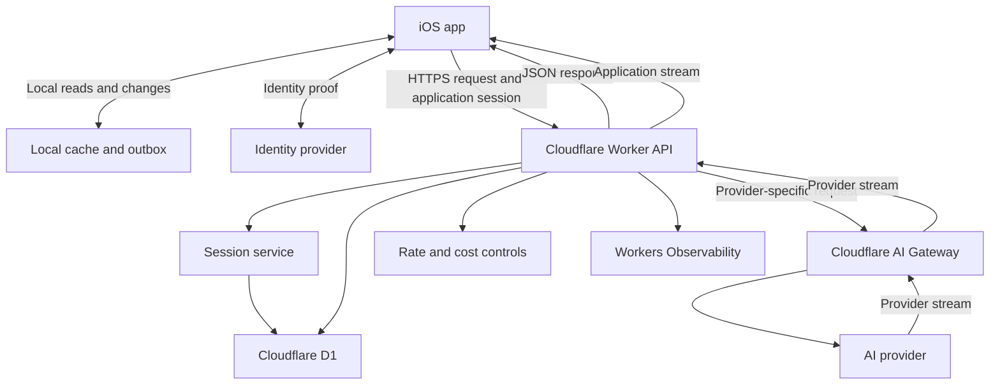

# System Overview

## Purpose

This architecture supports a native iOS app that uses a Cloudflare API and one or more AI providers.

The architecture starts with a small system. It adds Cloudflare services only after a requirement needs them.

## Goals

- Run the public API on Cloudflare Workers.
- Keep all provider secrets on the server.
- Authenticate each protected request with an application session.
- Authorize access to each requested resource.
- Store authoritative application data behind the API.
- Use local iOS storage for fast startup and limited offline work.
- Serve application data through versioned JSON endpoints.
- Stream AI output to the iOS app.
- Keep the client protocol independent of AI providers and models.
- Give AI providers only approved and authorized context.
- Support clear failure handling, observability, and cost controls.

## Non-goals

- This architecture does not define a product domain.
- This architecture does not define product roles or workflows.
- The first system does not require large-file storage.
- The first system does not require long background jobs.
- The first system does not require shared real-time state.
- The first system does not require resumable AI streams.
- The first system does not require semantic search.

## Architectural rules

These rules apply to all implementations:

1. The API is the source of truth for synchronized application data.
2. The iOS app treats local synchronized data as a cache.
3. The iOS app never receives an AI provider secret.
4. The Worker authenticates and authorizes a request before it reads protected data.
5. The Worker selects the provider, model, tools, limits, and context.
6. The iOS app uses an application-owned API contract.
7. The Worker converts provider events to the application stream protocol.
8. The Worker treats user content and stored context as untrusted data.
9. Each record has one authoritative cloud owner.
10. Optional services require a clear product or operational need.

## System diagram

## Components

| Component | Responsibility |
|---|---|
| iOS app | Displays the interface, keeps a local cache, stores the session token, and calls the API. |
| Local data service | Loads cached data, stores drafts, and sends permitted offline changes later. |
| Identity provider | Proves the identity of a person during sign-in. |
| Session service | Creates, validates, refreshes, and revokes application sessions. |
| Cloudflare Worker | Runs JSON endpoints, authorization, context selection, provider adapters, and stream conversion. |
| Cloudflare D1 | Stores sessions and relational application data. |
| Cloudflare AI Gateway | Routes provider requests and supplies AI metrics and controls. |
| AI provider | Runs model inference and returns provider-specific output. |
| Workers Observability | Records safe operational events, errors, timing, and usage. |

## Generic terms

| Term | Meaning |
|---|---|
| Principal | An authenticated user or service. |
| Authorization scope | A boundary that groups access to resources. |
| Resource | An API object that requires authorization. |
| Record | A stored representation of a resource or system event. |
| Context item | Authorized data that the Worker can include in an AI request. |
| Provider adapter | Server code that maps the application AI contract to one provider. |
| Application stream | Provider-neutral events that the Worker sends to the iOS app. |

## Trust boundaries

The iOS app is an untrusted client. The Worker does not accept client claims as proof of access.

The AI provider is an external processor. The Worker sends only the context that the current request permits.

Stored content is data, not an instruction source. Stored content cannot grant access or replace server rules.

## Related documents

- [Authentication and security](authentication-and-security.md)
- [Application API](application-api.md)
- [Data and offline behavior](data-and-offline.md)
- [AI API and streaming](ai-api-and-streaming.md)
- [AI context](ai-context.md)
- [Operations and evolution](operations-and-evolution.md)
